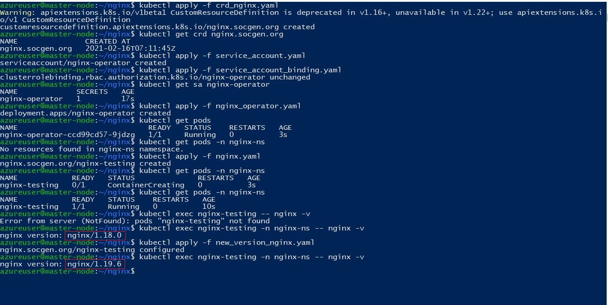

# Basic Kubernetes operator for Nginx

This operator will help to install Nginx server on customized port, namespace, nodeport, name and version. The update operation will help to upgrade the version of Nginx server as shown below.

# Pre-requisites

- Working kubernetes cluster 
- Account with cluster admin privileges
- Access to internet

# Test case

- Create a custom namespace for this testing. In this example, we are creation nginx-ns

             kubectl create ns nginx-ns
            
- Create custom resource definition(CRD) for the Nginx operator.

             kubectl apply -f crd_nginx.yaml
            
 - Create service account and role bindings for the service account
 
             kubectl apply -f service_account.yaml
             kubectl apply -f service_account_binding.yaml
 
- Deploy for operator in the cluster 

             kubectl apply -f nginx_operator.yaml
            
- Create the Nginx object with nginx.yaml. First we are going to create with version 1.18.0 as mention in yaml file

             kubectl apply -f nginx.yaml
            
- Check if the pods are up and running. 

             kubectl get pods --all-namespaces
             kubectl get pods -n nginx-ns
            
- Now test the version of nginx by connecting to the pod.This will show the version as 1.18.0

             kubectl exec nginx-testing -n nginx-ns -- nginx -v
             
- Let us now try to upgrade the nginx server to 1.19.6 as mentioned in the yaml file - new_version_nginx.yaml

             kubectl apply -f new_version_nginx.yaml
             
- Let us now test the version of nginx by connecting to the pod.This should show the version as 1.19.6. This completes our testing excercise.

             kubectl exec nginx-testing -n nginx-ns -- nginx -v
    
 # Output for quick reference
 
 
